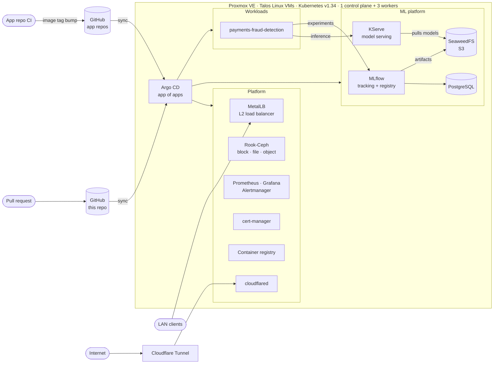
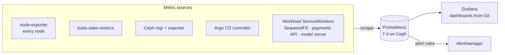
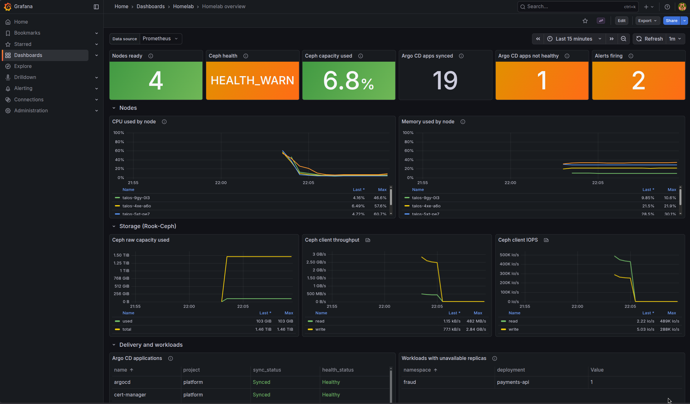
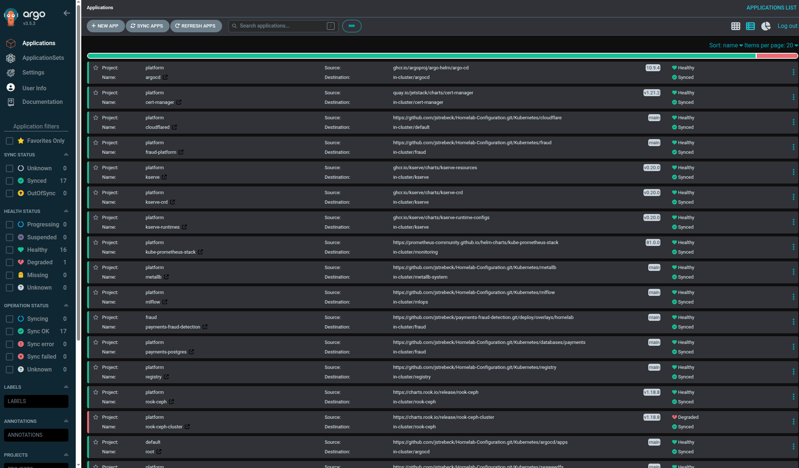

# Homelab Configuration

[](https://github.com/jstrebeck/Homelab-Configuration/actions/workflows/validate.yaml)


Declarative configuration for a four-node Kubernetes cluster (Talos Linux VMs
on Proxmox VE) and the
platform services running on it. Everything the cluster runs is defined in
this repository and delivered by Argo CD: merging to `main` is the deployment.

## Architecture



### Cluster

| | |
|---|---|
| **Nodes** | Proxmox VE virtual machines |
| **OS** | [Talos Linux](https://www.talos.dev/) v1.11: immutable, API-managed, no SSH |
| **Kubernetes** | v1.34, 1 control-plane node + 3 workers, 8 vCPU / 32 GiB each |
| **Networking** | Flannel CNI; MetalLB in L2 mode hands out `192.168.2.201-250` to `LoadBalancer` Services |
| **Storage** | Rook-Ceph across 3 × 500 GiB OSDs, 3-way replicated: `ceph-block` (default RWO), `ceph-filesystem` (RWX), `ceph-bucket` (object) |
| **Ingress from the internet** | Cloudflare Tunnel (`cloudflared`), so no ports are opened on the home router |
| **Images** | In-cluster registry at `192.168.2.203:5000`, trusted by every node through a Talos machine-config patch |

### Platform services

| Component | Namespace | Purpose | Delivered as |
|---|---|---|---|
| [Argo CD](Kubernetes/argocd/) | `argocd` | GitOps controller, manages itself | Helm `argo-cd` 10.9.4 |
| [MetalLB](Kubernetes/metallb/) | `metallb-system` | Bare-metal `LoadBalancer` IPs | Upstream manifest v0.14.5 + kustomize |
| [Rook-Ceph](Kubernetes/ceph-rook/) | `rook-ceph` | Distributed block, file and object storage | Helm `rook-ceph` + `rook-ceph-cluster` v1.18.8 |
| [kube-prometheus-stack](Kubernetes/grafana/) | `monitoring` | Prometheus, Alertmanager, Grafana, node-exporter; dashboards from Git | Helm 81.0.0 + kustomize |
| [cert-manager](Kubernetes/cert-manager/) | `cert-manager` | Webhook certificates (KServe) | Helm v1.21.2 |
| [KServe](Kubernetes/kserve/) | `kserve` | Model serving in Standard (raw Deployment) mode | Helm v0.20.0 (CRDs, controller, runtimes) |
| [SeaweedFS](Kubernetes/seaweedfs/) | `seaweedfs` | S3-compatible object store for ML artifacts | Manifest |
| [MLflow](Kubernetes/mlflow/) | `mlops` | Experiment tracking and model registry | Manifest, custom image |
| [Registry](Kubernetes/registry/) | `registry` | Private container registry | Manifest |
| [cloudflared](Kubernetes/cloudflare/) | `default` | Cloudflare Tunnel connector | Manifest |
| [Databases](Kubernetes/databases/) | per consumer | PostgreSQL, one instance per application | Manifest |

## Observability



[kube-prometheus-stack](Kubernetes/grafana/) runs Prometheus, Alertmanager and
Grafana. Prometheus picks up every `ServiceMonitor` and `PrometheusRule` in the
cluster, so a component becomes monitored by shipping one alongside its
manifests: Rook adds the Ceph metrics and alert rules, Argo CD exposes the sync
and health of every Application, and application repos bring their own.

Dashboards live in Git as ConfigMaps
([`Kubernetes/grafana/dashboards/`](Kubernetes/grafana/dashboards/)) and are
loaded by Grafana's sidecar without a restart:

- **Homelab overview:** node readiness, CPU and memory; Ceph health, capacity,
  throughput and IOPS; Argo CD sync and health per Application; firing alerts;
  workloads missing replicas.
- **Kubernetes:** object counts, CPU and memory requests and limits against
  capacity, per-namespace and per-node usage, CPU throttling and restarts.
- **Ceph:** cluster, per-OSD and per-pool dashboards maintained by Rook.
- The chart's standard cluster, node, namespace and workload dashboards.



## GitOps workflow

Argo CD runs the [app-of-apps](https://argo-cd.readthedocs.io/en/stable/operator-manual/cluster-bootstrapping/)
pattern. [`Kubernetes/argocd/root.yaml`](Kubernetes/argocd/root.yaml) is the
only manifest ever applied by hand; it points at
[`Kubernetes/argocd/apps/`](Kubernetes/argocd/apps/), where each file declares
one or more `Application`s.



1. A change (new chart version, values tweak, new component) lands on `main`
   through a pull request.
2. Argo CD detects the new revision and syncs the affected applications.
   Sync waves order a cold start: projects → Argo CD → MetalLB → storage →
   monitoring and cert-manager → KServe → workloads.
3. Application repositories own their workloads. Their CI builds and pushes
   an image, then bumps the tag in their own `deploy/overlays/homelab`, which
   Argo CD picks up. This repo only holds the `Application` pointing at it.

**Checks on every pull request** ([`validate.yaml`](.github/workflows/validate.yaml))

- [`scripts/render-apps.py`](scripts/render-apps.py) renders every
  `Application` exactly as Argo CD would (Helm with the pinned chart and
  values, kustomize, or a filtered directory) and fails if a path or values
  file is missing.
- `kubeconform` validates the output against the Kubernetes 1.34 schemas and
  the CRD schemas (Ceph, Prometheus, cert-manager, KServe, ...).
- `terraform fmt` and a `gitleaks` scan of the full history.

Chart and image versions are kept current by [Renovate](renovate.json), which
opens a pull request per update (Rook-Ceph and KServe charts grouped, majors
held for approval). Merging the PR is the upgrade.

**Guardrails**

- `AppProject`s split trust: `platform` may manage cluster-scoped resources;
  application projects are confined to their own namespace and repo.
- Automatic pruning is off for platform apps. A deleted manifest is flagged,
  not removed, so a bad commit can't take a CRD, namespace or PVC (and its
  data) with it.
- No `resources-finalizer` on `Application`s: deleting one from Argo CD never
  cascades into the cluster.
- Secrets never enter Git. Manifests reference them by name and each
  component README documents how to create them.

## Repository layout

```
Kubernetes/
  argocd/           Argo CD install values, root app, and every Application
  <component>/      Manifests or Helm values for one platform component + README
  databases/        PostgreSQL instances, one folder per consumer
Terraform/          Proxmox VM definitions (first-generation cluster and utility VMs)
Ansible/            kubeadm playbooks for the first-generation cluster
cloud-init/         Proxmox Ubuntu cloud-init template
EKS/                EKS Anywhere bare-metal hardware inventory (experiment)
docs/adr/           Architecture Decision Records
scripts/            CI helpers (render every Argo CD Application)
```

Design decisions and their trade-offs are recorded as
[Architecture Decision Records](docs/adr/).

Every component directory has a README covering what it is, why it's
configured the way it is, how to deploy it by hand, and how to verify and tear
it down.

## Bootstrapping a new cluster

```bash
# 1. Talos: trust the in-cluster registry on every node
talosctl patch mc -p @Kubernetes/registry/talos-patch.yaml -n <node-ips>

# 2. Argo CD, then hand it the repo
helm install argocd oci://ghcr.io/argoproj/argo-helm/argo-cd --version 10.9.4 \
  --namespace argocd --create-namespace -f Kubernetes/argocd/values.yaml
kubectl apply -f Kubernetes/argocd/root.yaml

# 3. Create the Secrets listed in each component's README
```

Argo CD installs everything else in wave order and adopts its own Helm release.

## History

The lab started as Ubuntu VMs on Proxmox, provisioned with
[Terraform](Terraform/) and turned into a kubeadm cluster with
[Ansible](Ansible/). It has since moved to Talos Linux, from Longhorn to
Rook-Ceph for storage, and from `kubectl apply` / `helm install` runbooks to
Argo CD. The earlier tooling stays in the repo as a record of that evolution.
